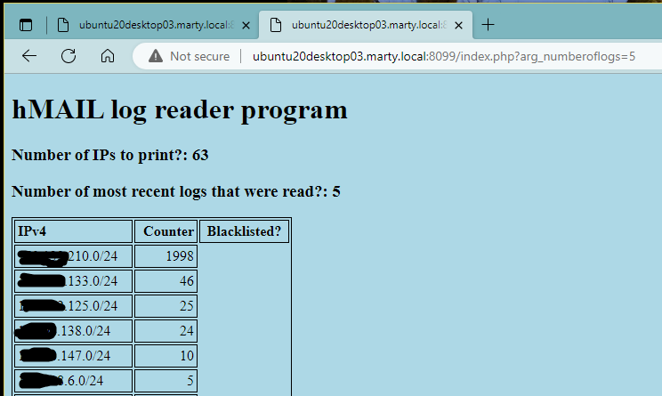

# hMAIL Log Reader
This is a very simple PHP script will read some or ALL of the hMAIL logs that contain TCPIP data
and then summarize the external IP addresses (first three octets) with the most TCPIP hits.
There is nothing fancy about the web-based output.

# Why create this PHP code?
* I noticed that there are several "actors" hitting the hMAIL server, but without actually attempting to logon (and therefore Auto-ban isn't locking them out). I can see in the logs that they are just simple SMTP hits.
* I thought about using MYSQL. There are several references in the hMAIL community/end user forum where folks are attempting to utilize MYSQL, but are having trouble with libmysql.dll.
* I created this PHP code to read native log files without (hopefully) too much trouble.
* I use a reverse proxy and manually blacklist the IPs determined in this script (working on automating this with the proxy's RESTful API in the future)

## psuedo code:
* Setup variables, accept arguments, print basic header info.
* Call function that reads directory share to determine which log files to read.
* This in turn calls a function that summarizes the data for each IP read in the logs.
  The rows retrieved via REGEX are "TCPIP" entries created in hMAIL.
  The text searched using REGEX is "TCP - 123.123.123.123 connected"
* Example:  "TCPIP"	2696	"2023-03-29 00:00:05.809"	"***TCP - 10.126.26.136 connected*** to 10.126.26.43:25."
* Sort and print data up to the number of entries requested in the URL argument.

## Requirements/Infrastructure
This was created in a home lab and is not part of a large corporate IT department.
* hMAIL is running on a Windows 2019 server.
  Logging must be enabled and "TCP/IP" transactions checked. Other entries can be selected for your needs, but won't affect this script.
* The PHP code is running on a Ubuntu 20.04.6 LTS that has Apache and PHP installed.

## Customization for this script needed on your part
* ~~The first line of the fct_readdir function contains the path that houses the log files. Change the system name and/or path that points to your log files.~~
  UPDATE: path to logs is now in "logreaderapp.json".
  On my Windows system, I setup FTP (IIS is installed by default) for reading the logs. Since this PHP script is used only internally, I setup FTP to access the folder using "anonymous".
  Note: my logs are changed daily and are not zipped/compressed.
* The first line of the fct_readfile function contains internal LAN IPs (three octets) that can be ignored.

## Recent updates
* Added second URL argument for "number of most recent logs to read".
* Both URL arguments are optional. Please note that the script will include all entries for all logs in the file path specified in the logreaderapp.json file.

## Future changes?
* **Partial update** Replace hard coded entries (hMAIL log directory, whitelist/blacklist IP addresses) with something flexible, such as .INI or .CONF files.
    A whitelist could be useful to bypass your internal LAN addresses.
    A blacklist can identify IP addresses that are blacklisted on a firewall, reverse proxy, etc.
* **Updated** Add a second URL argument to limit the number of logs read rather than read all of them (e.g., read only the last three days of logs)
* Add a third(?) URL argument to perform searches by date and time or change this script to utilize a form.
* Test using IIS (not sure if running this on the same server as hMAIL is a security issue?).
* Format the output using basic CSS.

* Create a version of this using hashbang for a Windows command prompt or Unix terminal?? That way a web server isn't required to run this.
* Create a version of this using hashbang in Python for a Windows command prompt or Unix terminal??

## How to call the URL
This depends on how and where the web server is installed (IIS, Apache), and any specific ports used. If the script is on a local web server, the call to this program is:

The "?arg_entries" argument **is optional** will display the highest number of hits/entries; in this case, the argument is specified as 10. The "?arg_numberoflogs" argument **is also optional** and will read the path's logs; in this case the argument is specified as 5.

http://ubuntu20desktop03.marty.local:8099/index.php?arg_entries=10&arg_numberoflogs=5

or

The "?arg_entries" argument is specified and will display the highest number of hits/entries; in this case, the argument is specified as 10. The "?arg_numberoflogs" argument is not specified and will read all of the path's logs;
http://127.0.0.1:8099/index.php?arg_entries=10

or

The "?arg_entries" argument is not specified and will display the highest number of hits/entries. The "?arg_numberoflogs" argument is specified and will read all of the path's logs; in this case the argument is specified as 5.
http://ubuntu20desktop03.marty.local:8099/index.php?arg_numberoflogs=5

or

If neither argument is specified, they will default to the most entries for both the number of IPs to read and the number of logs to read in the file path.
http://ubuntu20desktop03.marty.local:8099/index.php

