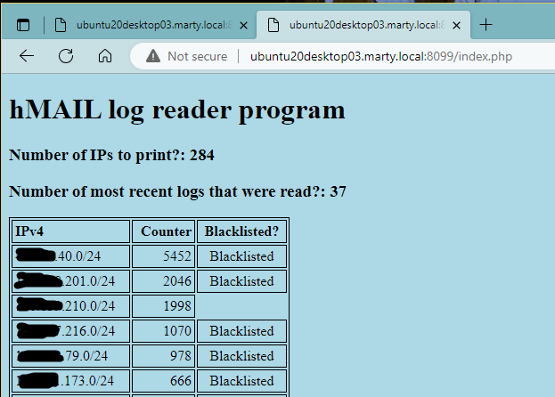

# hMail Log Reader
This is a relatively simple PHP script will read some or ALL of the hMail logs that contain TCPIP data and then summarize the external IP addresses (first three octets) with the most TCPIP hits. There is nothing fancy about the web-based output.

## Why create this PHP code?
* I noticed that there are several "actors" hitting the hMail server, but without actually attempting to logon (and therefore Auto-ban isn't locking them out). I can see in the logs that they are just simple SMTP and IMAP hits.
* I thought about using MYSQL. There are several references in the hMail community/end user forum where folks are attempting to utilize MYSQL, but are having trouble with libmysql.dll.
* I created this PHP code to read native log files without (hopefully) too much trouble.
* I use a reverse proxy and manually blacklist the IPs determined in this script (working on automating this with the proxy's RESTful API in the future)

## pseudo code:
* Setup variables, accept arguments, print basic header info.
* Call function that reads directory share to determine which log files to read.
* This in turn calls a function that summarizes the data for each IP read in the logs.
 The rows retrieved via REGEX are "TCPIP" entries created in hMail.
* Example:  "TCPIP"	2696	"2023-03-29 00:00:05.809"	"***TCP - 10.126.26.136 connected*** to 10.126.26.43:25."
* Sort and print data up to the number of entries requested in the URL arguments.

## Requirements/Infrastructure
This was created in a home lab and is not part of a large corporate IT department.
* I have hMail running on a Windows 2019 server. hMail logging must be enabled and "TCP/IP" transactions checked. Other entries can be selected for your needs, but won't affect this script.
* The web server that I have running is a Ubuntu 20.04.6 LTS that has Apache version 2.4.41 and PHP version 7.4.3 installed.

## Installation
Once a web server is setup, three files are needed:
- index.php
- logreaderapp.json
- mystyle.css

Change the "logreaderapp.json".
- change the "path" section to reflect your system name and file path
- add any desired IPv4 addresses to whitelist. This is setup as an array.
- add any IPv4 addresses to show on the webpage that could be blacklisted in your firewall, reverse proxy, etc. This is also an array.

If you are running Apache, you may need to update:
- your "ports.conf" to include a specific port
- add a separate folder in the "sites-available" and "sites-enabled" folders.

On my Windows 2019 system, I setup FTP for reading the logs. Since this PHP script is used only internally, I setup FTP to access the folder using "anonymous". My logs are changed daily and are not zipped/compressed.

CAVEAT: only IPv4 /24 addresses are valid at this time.

## Recent updates
* Added second URL argument for "number of most recent logs to read".
* Both URL arguments are optional. Please note that the script will include all entries for all logs in the file path specified in the logreaderapp.json file.
* The path to read the log files are in the logreaderapp.json file.
* Both whitelist and blacklist are functional based on logreaderapp.file. If an IP address is in the blacklist, the script will show ***Blacklisted*** alongside the Counter value.
  PLEASE NOTE: only IPv4 /24 addresses are valid at this time.
* Added very basic CSS to format the output.

## Future changes?
* Add a third URL argument to perform searches by date and time or change this script to utilize a form.
* Test using IIS (not sure if running this on the same server as hMail is a security issue?).
* **In Progress** Update this script to enable using a Windows command prompt or Unix terminal. That way a web server isn't required to run this.

## How to call the URL
This depends on where the web page is called from (localhost or another host), and any specific ports used. Please see the examples below for URL calls to a named server and localhost (127.0.0.1).

http://ubuntu20desktop03.marty.local:8099/index.php?arg_entries=10&arg_numberoflogs=5
 or 
http://127.0.0.1:8099/index.php?arg_entries=10&arg_numberoflogs=5

* The "?arg_entries" argument **is optional** will display the highest number of hits/entries; in this case, the argument is specified as 10.
* The "?arg_numberoflogs" argument **is also optional** and will read the path's logs; in this case the argument is specified as 5.
* If either or both arguments are omitted, the web page will display the actual number of log files and IP addresses that were read.

The "?arg_entries" argument is specified and will display the highest number of hits/entries; in this case, the argument is specified as 10. The "?arg_numberoflogs" argument is not specified and will read all of the path's logs;

The "?arg_entries" argument is not specified and will display the highest number of hits/entries. The "?arg_numberoflogs" argument is specified and will read all of the path's logs; in this case the argument is specified as 5.

If neither argument is specified, they will default to the most entries for both the number of IPs to read and the number of logs to read in the file path.

