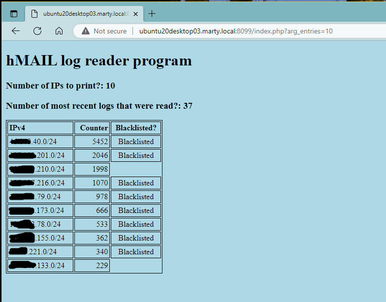

# hMAIL Log Reader

This is a very simple PHP script will read ALL of the hmail logs that contain TCPIP data
and then summarize the external IP addresses (first three octets) with the most TCPIP hits.
There is nothing fancy about the output.

# Why create this PHP code?
* I noticed that there are several "actors" hitting the hMAIL server, but without actually attempting to logon (and therefore Auto-ban isn't locking them out). I can see in the logs that they are just simple SMTP hits.
* I thought about using MYSQL. There are several references in the hMAIL community/end user forum where folks are attempting to utilize MYSQL, but  are having trouble with the 32-bit LIBMYSQL.DLL.
* I created this PHP code to read native log files without (hopefully) too much trouble.
* (I use the default log file names such as "hmailserver_2000-12-31.log")

## psuedo code:
* Setup variables, print basic header info, accept argument for number of entries to print.
* Call function that reads directory share to determine which log files to read.
* This in turn calls a function that summarizes the data for each IP read in the logs.
  The rows retrieved via REGEX are "TCPIP" entries.
  The actual line searched for using REGEX is "TCP - 123.123.123.123 connected"
* Example:  "TCPIP"	2696	"2023-03-29 00:00:05.809"	"**TCP - 10.126.26.136 connected** to 10.126.26.43:25."
* Sort and print data up to the number of entries requested in the URL argument.

## Requirements/Infrastructure
This was created in a home lab and is not part of a large corporate IT department.
* hMAIL is running on a Windows 2019 server.
  Logging must be enabled and "TCP/IP" transactions checked. Other entries can be selected for your needs, but won't be read by this script.
* The PHP code is running on a Ubuntu 20.04.6 LTS that has Apache and PHP installed.

## Customization for this script needed on your part
* Create a share that the PHP code can read using FTP
  Since this PHP script is access internally, I created the share as "anonymous".
* The first line of the fct_readdir function contains the directory that houses the log files.
  Note: my logs are changed daily and are not zipped/compressed.
* The first line of the fct_readfile function contains your internal LAN IPs (three octets) that should be ignored.

## Future changes?
* Replace hard coded entries (hMAIL log directory, internal IP addresses) with something flexible, such as .INI or .CONF files
* Add a second URL argument to limit the number of logs read rather than read all of them (e.g., read only the last three days of logs)
* Add a third(?) URL argument to perform searches by date and time.
* Test using IIS (not sure if this script should be on the same server as hMAIL).

## How to call the URL
Depending on how and where the web server is installed (IIS, Apache), and any specific ports used, the call to this program is:

http://127.0.0.1:8099/index.php?arg_entries=10

The "?arg_entries" argument will display the top most number of entries; in this case, 10.

